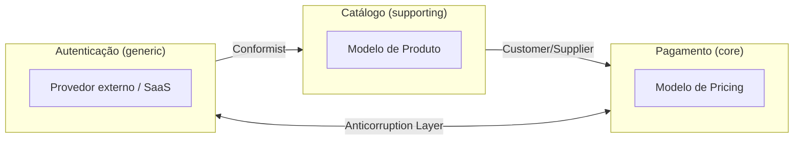

Vlad Khononov publicou **Learning Domain-Driven Design** em 2021, quase vinte anos depois do livro original de Eric Evans. A proposta é diferente da de Evans e da de Vernon: Khononov escreve para quem nunca ouviu falar de DDD e quer uma porta de entrada direta, sem o peso histórico do "livro azul" nem a extensão do "livro vermelho". O livro é mais curto, mais didático, e organizado numa progressão clara — do problema de negócio até o código, e do código até como o DDD conversa com microsserviços, arquitetura orientada a eventos e data mesh.

A contribuição mais própria de Khononov é reformular DDD como uma ferramenta de **alinhamento de investimento**: nem todo pedaço do sistema merece o mesmo nível de sofisticação de modelagem. O objetivo não é "fazer DDD tático em tudo" — é decidir, de forma deliberada, onde a complexidade adicional de um Domain Model rico compensa, e onde um CRUD simples resolve melhor.

## O problema que o DDD resolve

A tese de Khononov começa de um ângulo ligeiramente diferente do de Vernon: ele separa **complexidade essencial** (a que vem do próprio domínio de negócio) de **complexidade acidental** (a que o software introduz por conta própria — abstrações desnecessárias, camadas em excesso, padrões aplicados sem necessidade). Um sistema mal desenhado frequentemente tem as duas ao mesmo tempo: modela como simples um problema que é complexo (perdendo regra de negócio no meio do caminho), e modela como complexo um problema que é simples (gastando semanas de arquitetura num CRUD).

DDD, para Khononov, é o conjunto de práticas que ajuda a diagnosticar corretamente qual complexidade você está de fato enfrentando — e só depois escolher a ferramenta certa. Design estratégico decide **onde** investir; design tático decide **como** modelar dentro de onde foi decidido investir.

## Subdomínios: a pergunta que vem antes de qualquer código

Antes de desenhar qualquer classe, Khononov insiste em responder: essa parte do negócio é **core**, **supporting** ou **generic**? A resposta não é sobre dificuldade técnica — é sobre **valor competitivo**.

- **Core domain** — a razão pela qual a empresa ganha dinheiro de um jeito que a concorrência não replica facilmente. Aqui, investir pesado em modelagem tem retorno direto.
- **Supporting subdomain** — necessário para o core funcionar, mas não é o diferencial. Merece um modelo correto, sem luxo.
- **Generic subdomain** — problema já resolvido pelo mercado (autenticação, envio de e-mail, processamento de pagamento). Khononov é enfático: **compre ou use algo pronto**; modelar do zero aqui é desperdiçar o recurso mais escasso do time.


O erro mais comum que ele descreve — e que aparece nos dois lados do espectro — é tratar um generic subdomain como se fosse core (reinventando um sistema de autenticação "porque é mais barato no início") ou tratar o core domain como generic (terceirizando ou simplificando demais a parte que deveria ser o diferencial competitivo da empresa).

## Linguagem ubíqua: o vocabulário que expõe o modelo mental

A linguagem ubíqua continua sendo, para Khononov, o instrumento de diagnóstico mais barato que existe: se um desenvolvedor não consegue explicar uma regra de negócio usando as mesmas palavras que um especialista de domínio usaria, o modelo de código provavelmente já divergiu do modelo mental real. Ele reforça um ponto que Vernon já tinha levantado, mas com ênfase prática: a linguagem ubíqua **não é global** — ela só é consistente dentro de um bounded context, e a mesma palavra pode (e deve) significar coisas diferentes fora dele.

## Bounded context: fronteira de linguagem, não só de código

Aqui está uma diferença sutil e importante em relação a Vernon: Khononov define bounded context primeiro como uma **fronteira linguística** — o espaço onde um termo tem um único significado consistente — e só depois como fronteira técnica (serviço, banco de dados, repositório de código). A fronteira de linguagem existe mesmo antes de qualquer decisão de arquitetura; a fronteira técnica é a materialização dela.

Essa ordem importa na prática: times que desenham microsserviços primeiro e tentam "descobrir" o bounded context depois de olhar para o código tendem a cortar o sistema no lugar errado — geralmente seguindo fronteira de tabela de banco de dados, não fronteira de significado de negócio.

## Context mapping: os mesmos padrões, reforçados por dinâmica de time

Khononov mantém o vocabulário clássico de context mapping (o mesmo catálogo que Evans e Vernon descrevem), mas conecta cada padrão explicitamente ao tipo de relação organizacional entre os times — inspirado no Team Topologies:



| Padrão | Dinâmica de time implícita | Quando Khononov recomenda |
|---|---|---|
| Partnership | Times com objetivo compartilhado, sem hierarquia | Dois core domains que dependem um do outro |
| Shared Kernel | Times aceitam coordenação de mudança conjunta | Overlap pequeno, estável, com baixo custo de sincronizar |
| Customer/Supplier | Fornecedor prioriza o roadmap do consumidor | Consumidor tem peso de negociação real |
| Conformist | Consumidor não tenta influenciar o fornecedor | Serviço interno de outro time sem interesse em cooperar, ou serviço externo |
| Anticorruption Layer | Isola o time do vocabulário e das mudanças de um modelo externo | Sempre que o modelo do outro lado não é confiável a longo prazo |
| Open Host Service | Um time serve muitos consumidores com um contrato estável | Plataforma interna ou API pública |
| Separate Ways | Nenhuma coordenação — duplicar é mais barato | Overlap pequeno e o custo de alinhar dois times supera o benefício |

## Os quatro padrões táticos: um espectro, não uma escolha binária

Esta é a parte mais didaticamente original do livro. Em vez de apresentar "o jeito certo" de fazer design tático (como o foco quase exclusivo de Vernon em Aggregate e Domain Model sugere), Khononov organiza quatro padrões num espectro de complexidade crescente, e insiste que a escolha certa depende do subdomínio — não é um padrão único aplicado ao sistema inteiro.


| Padrão | Complexidade | Onde a regra de negócio mora | Exemplo típico |
|---|---|---|---|
| Transaction Script | Baixa | Num procedimento único, do início ao fim | Cálculo simples de frete |
| Active Record | Baixa-média | No objeto que espelha a tabela, junto com load/save | Catálogo de produto (CRUD) |
| Domain Model | Alta | Em Entidades, Value Objects e Aggregates com invariante protegida | Motor de precificação dinâmica |
| Event-Sourced Domain Model | Alta + necessidade de histórico | No log imutável de eventos; o estado atual é derivado, nunca a fonte da verdade | Detecção de fraude, auditoria financeira |

O ponto central: **um sistema saudável normalmente usa mais de um desses padrões ao mesmo tempo**, um por bounded context, escolhido de acordo com onde aquele subdomínio cai na matriz de valor x complexidade. Forçar Domain Model rico num generic subdomain é over-engineering; forçar Transaction Script num core domain complexo é sub-engineering — e ambos, para Khononov, são falhas de DDD tão graves quanto não usar DDD algum.

## Padrões de comunicação: coreografia x orquestração

Quando um fluxo de negócio atravessa mais de um bounded context, Khononov descreve dois estilos de coordenação:

- **Coreografia** — cada contexto reage a eventos de domínio publicados pelos outros, sem um coordenador central. Baixo acoplamento, mas o fluxo completo fica implícito, espalhado entre vários serviços — difícil de visualizar de uma vez.
- **Orquestração (Saga)** — um processo central conhece e comanda cada etapa explicitamente. Mais fácil de entender e depurar o fluxo inteiro, mas cria um ponto de acoplamento e de decisão centralizado.

A recomendação prática é usar coreografia para reações simples e desacopladas (ex: "quando o pedido é confirmado, decrementar estoque") e orquestração quando o fluxo tem lógica de compensação em caso de falha parcial (ex: reembolso automático se o pagamento passar mas a reserva de estoque falhar).

## Exemplo prático: modelando um e-commerce

Para tornar o espectro tático concreto, considere um e-commerce simples com três subdomínios:

**1. Catálogo de produtos** — supporting, baixa complexidade de regra. Um produto tem nome, preço-base, categoria e estoque. Não há comportamento rico: é leitura e escrita direta. Active Record resolve bem:

```typescript
class Product {
  constructor(private id: string, private name: string, private priceCents: number) {}

  static async load(id: string): Promise<Product> {
    const row = await db.query("SELECT * FROM products WHERE id = ?", [id]);
    return new Product(row.id, row.name, row.price_cents);
  }

  async save(): Promise<void> {
    await db.query("UPDATE products SET name = ?, price_cents = ? WHERE id = ?",
      [this.name, this.priceCents, this.id]);
  }
}
```

**2. Motor de precificação promocional** — core domain: é aqui que a empresa compete (descontos combinados, regras de cupom, limites por cliente). A regra de negócio é entrelaçada e tem invariante real (um cupom não pode ser aplicado duas vezes; descontos percentuais e fixos não se combinam livremente). Isso pede Domain Model:

```typescript
class PricingQuote {
  private appliedDiscounts: Discount[] = [];

  constructor(private readonly basePrice: Money) {}

  applyDiscount(discount: Discount): void {
    if (this.appliedDiscounts.some(d => d.conflictsWith(discount))) {
      throw new IncompatibleDiscountError(discount);
    }
    this.appliedDiscounts.push(discount);
  }

  finalPrice(): Money {
    return this.appliedDiscounts.reduce(
      (price, discount) => discount.applyTo(price),
      this.basePrice
    );
  }
}
```

Note a diferença: `Product` não sabe nada sobre si mesmo além de seus dados — quem decide o que fazer é quem chama `load`/`save`. `PricingQuote` **protege sua própria invariante** (`applyDiscount` recusa combinação inválida antes que ela aconteça); a regra de negócio mora dentro do objeto, não espalhada em algum service.

**3. Autenticação de usuário** — generic subdomain. Aqui a decisão certa, segundo Khononov, nem é escrever código de modelagem: é integrar um provedor pronto (Auth0, Clerk, Cognito) via Anticorruption Layer, e não gastar nenhum ciclo de design tático além do necessário para isolar esse fornecedor do resto do sistema.

O ponto do exemplo: as três partes convivem no mesmo sistema, com três níveis de sofisticação de modelagem completamente diferentes — e essa diferença é a decisão de design mais importante do livro, tomada antes de qualquer linha de código tático.

## O que ainda vale hoje

Por ser o mais recente dos três clássicos de DDD, o livro de Khononov já nasce falando a língua de sistemas distribuídos modernos: ele dedica capítulos inteiros a mapear DDD contra microsserviços, arquitetura orientada a eventos e até data mesh, deixando claro que bounded context é o conceito que se traduz quase 1:1 para "limite de serviço" nesses mundos — mas que microsserviço sem bounded context definido primeiro é só distribuir o monólito com latência de rede extra.

A crítica mais comum ao livro é que, por ser introdutório, ele cobre com menos profundidade tática o que Vernon detalha em centenas de páginas — quem já domina Aggregate e Domain Event pode achar essa parte rápida demais. Mas como mapa de decisão — **onde investir em modelagem e por quê** — é hoje a referência mais direta e mais fácil de aplicar em um time que está começando com DDD do zero, especialmente em contextos onde nem tudo deveria virar Domain Model rico.
