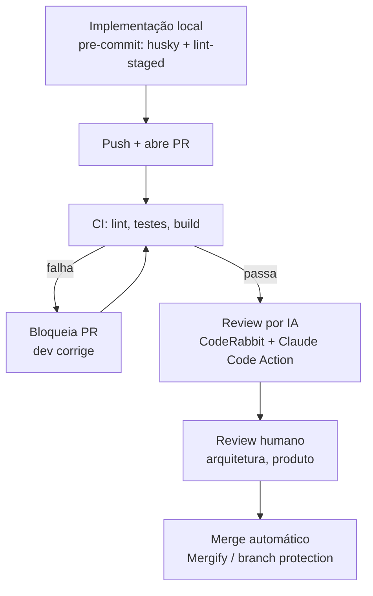

Review humano é o gargalo mais caro e mais lento do ciclo de PR. E boa parte do que ele pega — bug óbvio, teste faltando, import não usado, inconsistência com o padrão do resto do repo — não precisa de julgamento humano nenhum. Precisa só de alguém (ou algo) que leia o diff com atenção antes do humano chegar nele.

Esse post mostra como montar as camadas que tiram esse peso do caminho: pre-commit, CI, review por IA e só então review humano. O objetivo não é eliminar quem revisa — é fazer o review humano começar direto na pergunta que importa.

## As camadas do fluxo

Pensa nisso como pirâmide de custo. Cada camada é mais barata (em tempo, em atenção, em dinheiro) que a próxima, e filtra o que a próxima não precisa ver:



Pre-commit pega o que é instantâneo de pegar (formatação, lint óbvio) antes de virar commit. CI pega o que precisa rodar (testes, build, type-check). Review por IA pega o que precisa ler o diff inteiro com contexto — mas sem julgamento de negócio. Review humano entra só quando sobrou algo que exige decisão.

Pular uma camada não elimina o trabalho, só empurra ele pra frente — pra uma camada mais cara.

## CI como pré-requisito — não pule essa parte

Review por IA rodando num PR com CI quebrado é desperdício. A IA vai comentar estilo de código e sugerir refatoração num build que nem compila. Pior: o revisor humano vai ver os comentários da IA como ruído, porque o problema real (build quebrado) está em outro lugar.

Configuração mínima antes de qualquer camada de IA entrar:

```yaml
# .github/workflows/ci.yml
name: CI
on: pull_request

jobs:
  quality:
    runs-on: ubuntu-latest
    steps:
      - uses: actions/checkout@v4
      - uses: actions/setup-node@v4
        with: { node-version: 20 }
      - run: npm ci
      - run: npm run lint
      - run: npm run typecheck
      - run: npm test
      - run: npm run build
```

Marque `quality` como **required check** em Settings → Branches → Branch protection rules. Sem isso, nada do que vem depois tem por onde se apoiar — a IA e o humano estariam revisando código que nem passa no próprio critério mecânico do repo.

## CodeRabbit na prática

CodeRabbit é um app do GitHub que entra como reviewer automático em cada PR. Conecta em Settings → Integrations → GitHub Apps, autoriza o repo, e a partir do próximo PR ele já comenta.

A diferença pra um linter é que ele lê o diff com contexto — não só a linha alterada, mas o arquivo inteiro, o histórico de PRs anteriores no mesmo repo, e a descrição do PR. Isso muda o tipo de comentário que ele consegue fazer. Um linter pega `any` sem tipo. CodeRabbit pega "essa função duplica a lógica que você extraiu pro `UserService` na PR #142, considera reusar".

Exemplo de comentário real que ele geraria num diff que adiciona uma rota sem validação de input:

> ⚠️ **Possível problema:** este endpoint aceita `req.body.email` sem validação antes de passar pro `UserRepository.create()`. Os outros endpoints de criação no repo (`POST /orders`, `POST /products`) usam `class-validator` com DTO. Sugiro seguir o mesmo padrão aqui.

Ele também abre um resumo do PR (walkthrough) automaticamente e aceita comando interativo direto no comentário — `@coderabbitai review` força um novo pass, `@coderabbitai resolve` fecha uma thread de comentário, `@coderabbitai summary` regenera o resumo. Configuração fina (quais paths ignorar, quais regras de path-based instruction aplicar) vai num `.coderabbit.yaml` na raiz do repo.

## Claude Code GitHub Action na prática

O diferencial da Claude Code Action não é revisar diff — CodeRabbit já faz isso bem. É que ela reaproveita o `CLAUDE.md` e o `.claude/` que já existem no repo. O review "pensa" nas mesmas regras que você já usa localmente ao trabalhar com Claude Code, porque é literalmente o mesmo agente lendo o mesmo contexto — não uma ferramenta de terceiro tentando inferir seu padrão a partir só do diff.

Setup mínimo:

```yaml
# .github/workflows/claude-review.yml
name: Claude Code Review
on:
  issue_comment:
    types: [created]

jobs:
  review:
    if: contains(github.event.comment.body, '@claude')
    runs-on: ubuntu-latest
    steps:
      - uses: actions/checkout@v4
      - uses: anthropics/claude-code-action@v1
        with:
          anthropic_api_key: ${{ secrets.ANTHROPIC_API_KEY }}
```

Isso é o esqueleto — a doc oficial (`github.com/anthropics/claude-code-action`) cobre trigger automático em `pull_request` (sem precisar de `@claude` manual), permissões mínimas de token, e como passar um prompt de review customizado em vez do default. Não vou colar o YAML inteiro aqui porque ele muda com a versão da action; vale copiar da doc na hora de configurar, não deste post.

Invocar é um comentário `@claude revisa esse PR focando em segurança` na própria PR. A action sobe um runner, roda Claude Code em modo headless com o `CLAUDE.md` do repo carregado, e comenta o resultado.

**Quando isso supera CodeRabbit:** repo com convenções muito específicas — arquitetura em camadas custom, glossário de domínio próprio, regras de negócio documentadas em `docs/` que um reviewer genérico não tem como saber. É exatamente o caso deste monorepo: o `CLAUDE.md` aqui aponta pra `docs/skills/backend.md`, `docs/context/decisions.md` — regra que só existe porque está escrita, não porque é senso comum de mercado.

**Quando não vale a pena duplicar:** repo pequeno, convenções genéricas (um CRUD simples, sem regra de domínio incomum). Rodar as duas camadas de IA nesse caso é custo (tempo de execução, ruído de dois reviewers automáticos) sem ganho real — CodeRabbit sozinho já cobre.

## Onde a IA para e o humano entra

Review de IA não resolve, e a lista é honesta de propósito — porque o objetivo aqui não é vender a ideia de que IA substitui revisor:

- **Trade-off de arquitetura.** "Esse serviço deveria ser um módulo novo ou entrar no existente" não tem resposta no diff — depende de contexto que não está no PR.
- **Decisão de produto.** "Essa validação deveria bloquear ou só avisar" é pergunta de negócio, não de código.
- **Dívida técnica assumida conscientemente.** Às vezes o time decide fazer o jeito errado rápido, documentado, com prazo pra corrigir. IA não distingue isso de descuido — vai sinalizar os dois do mesmo jeito.

O ganho de colocar IA nas camadas antes é justamente isolar esses três pontos: quando o review humano abre o PR, ele não está catando `any` sem tipo ou função duplicada — está direto na pergunta que só ele responde.

## Fechando o loop: merge automatizado

Com CI verde, aprovação humana e sem comentário bloqueante de IA pendente, o merge não precisa de mais nenhuma ação manual.

Duas formas de fazer isso:

- **Auto-merge nativo do GitHub** — habilita em Settings → General → "Allow auto-merge", e no PR clica "Enable auto-merge". Mergeia sozinho assim que os required checks passarem. Simples, cobre o caso comum.
- **Mergify** — quando você precisa de regra mais fina: fila de merge (merge queue) pra evitar que PRs paralelos quebrem uns aos outros na integração, priorização por label, batch merge. Configuração em `.mergify.yml` na raiz.

Pra maioria dos repos, branch protection + auto-merge nativo já fecha o loop. Mergify entra quando o volume de PR simultâneo cria conflito de integração real — não antes.

## O que fica

O ganho desse pipeline não é eliminar o review humano — é fazer ele parar de gastar atenção com o que uma camada mais barata já resolveria. Pre-commit pega o óbvio, CI garante que o código funciona, CodeRabbit e Claude Code Action pegam inconsistência e desvio de padrão, e o humano entra só pra decidir o que exige decisão.

Próximo passo natural, se fizer sentido como continuação: medir quanto tempo esse pipeline economiza por PR na prática — tempo até o primeiro comentário, tempo até merge, quantos comentários de IA viram fix antes do humano nem abrir o diff.
