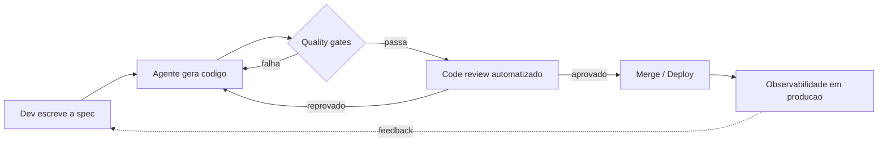

import Timeline from '@/components/mdx/Timeline.astro';
import TimelineItem from '@/components/mdx/TimelineItem.astro';
import Callout from '@/components/mdx/Callout.astro';

Todo mundo gera código com IA agora. Isso parou de ser diferencial faz tempo — é autocomplete de editor, é plugin, é chat lateral em qualquer IDE. O que separa quem entrega sistema em produção de quem entrega protótipo bonito não é mais saber "usar IA pra programar". É ter um framework por trás do prompt.

Esse framework tem 7 pilares. Nenhum deles é sobre qual modelo é melhor essa semana ou qual ferramenta lançou ontem. São sobre disciplina de engenharia — a mesma que sempre separou dev sênior de dev júnior, só que agora aplicada a um parceiro de trabalho que erra rápido e com muita confiança.

Vamos por eles, um de cada vez.

## Pilar 1 — IA First

O primeiro erro é tratar "IA" como uma coisa só. Modelo e agente não são sinônimos.

Um **modelo** (GPT, Claude, Gemini, o que for) é uma peça: recebe texto e prevê a sequência mais provável de continuação. Sozinho, ele não abre arquivo, não roda teste, não sabe se o código que acabou de gerar sequer compila. Um **agente** é a orquestração em volta do modelo — o loop que decide qual ferramenta chamar, qual arquivo ler, quando parar e perguntar, quando seguir sozinho. Cursor, Claude Code, Copilot Workspace: todos são agentes construídos sobre modelos, não os modelos em si.

Essa distinção importa porque explica o segundo mito: janela de contexto não é memória infinita. Todo modelo tem um limite de tokens que consegue processar de uma vez — e dentro desse limite, quanto mais informação irrelevante você empilha, pior a qualidade da resposta fica. Não é uma parede que você bate de repente; é degradação gradual. Um agente com 100 mil tokens de contexto sujo (logs, arquivos que não vêm ao caso, histórico de conversa que já resolveu o problema há três mensagens) responde pior que o mesmo agente com 10 mil tokens bem curados. Contexto não é "quanto mais, melhor" — é "quanto mais relevante, melhor".

É aqui que fundamento de engenharia volta a valer mais, não menos. Quando gerar código era o gargalo, decorar sintaxe rendia. Agora que qualquer pessoa gera um CRUD funcional em minutos, o gargalo virou julgamento: saber se aquele código é a decisão certa pro contexto do sistema, saber por que um índice composto resolve e um índice simples não, saber quando a sugestão do agente é elegante mas errada pro seu caso.

Quem entende isso para de escolher stack no feeling. Para de perguntar pro agente "qual banco eu uso" e aceitar a primeira resposta. Começa a pedir trade-off, comparar com o contexto real do projeto, e defender a decisão numa reunião de arquitetura com argumento técnico — não com "foi o que o Claude sugeriu".

<Callout type="info">
  Mais IA gerando código não significa menos você precisando saber engenharia — significa o oposto.
</Callout>

## Pilar 2 — Spec-Driven Development

O segundo pilar é a resposta direta pro vibe coding: spec-driven development é a disciplina de desenhar antes de gerar.

Vibe coding é pedir "faz um sistema de login" e aceitar o que vier. Funciona pra protótipo de fim de semana. Não funciona pra sistema que vai pra produção, porque o agente preenche toda ambiguidade que você deixou em aberto com a suposição mais genérica possível — e ela raramente é a certa pro seu contexto.

Spec-driven inverte a ordem: antes de gerar qualquer linha de código, você escreve o comportamento esperado com rigor. Não é documentação de arquitetura tradicional, burocrática, que ninguém lê depois. É uma spec funcional — o que o sistema deve fazer, quais os casos de borda, quais restrições não são negociáveis (latência, formato de dado, contrato de API), o que fica explicitamente fora de escopo.

A diferença aparece na prática. Em vez de "cria um endpoint de checkout", a spec diz: o endpoint recebe carrinho com N itens, valida estoque antes de cobrar, retorna 409 se algum item ficou indisponível entre a validação e a cobrança, e nunca cobra duas vezes pro mesmo idempotency-key. Isso não é over-specification — é a diferença entre um agente adivinhando seu domínio e um agente executando sua decisão.

Documentar e planejar com esse rigor antes de acionar o agente parece lentidão. É o oposto: é a etapa que evita reescrever o sistema inteiro depois que a suposição errada do agente já virou dependência de outras três partes do código.

<Callout type="tip">
  Teste rápido pra saber se sua spec está boa o suficiente: um dev júnior sem contexto do projeto conseguiria implementar só lendo ela, sem te perguntar nada? Se a resposta é não, o agente também vai adivinhar.
</Callout>

## Pilar 3 — Harness

Spec boa não garante código bom sozinha — ela garante que o agente sabe o que fazer. Falta garantir que, toda vez que ele fizer, o resultado passa no mesmo padrão de qualidade. Essa garantia é o **harness**.

Harness é a plataforma ao redor do agente: a codebase preparada pra ser lida e testada por ele (estrutura clara, testes que cobrem comportamento de verdade, lint que pega erro antes de humano ver), mais o loop de automações que roda em cima de cada geração — code review automatizado, quality gates que bloqueiam merge se a cobertura cair ou se um padrão de segurança for violado, pipelines que rodam sem alguém precisar lembrar de rodar.

A diferença entre protótipo e sistema em produção não é o agente ser mais inteligente num caso do que no outro. É que no protótipo você testou a função na mão, uma vez, e funcionou. Em produção, a mesma função — e as próximas mil que o agente vai gerar depois dela — passam pelo mesmo funil de verificação, sem depender de ninguém lembrar de olhar.

O loop, na prática, se parece com isso:

Repare que o humano entra duas vezes nesse loop: escrevendo a spec no início, e lendo o feedback de produção no fim. No meio, é gate cuidando de gate. Isso é o que permite escalar — sem harness, cada geração nova é uma aposta nova, e a qualidade vira sorte em vez de processo.

## Pilar 4 — O Novo Dev

Quando o agente escreve a maior parte do código, a pergunta que decide sua relevância deixa de ser "você consegue escrever isso rápido" e passa a ser "você consegue dizer se isso está certo".

Isso muda o risco também. Existe uma atrofia de skill real quando você para de escrever e passa só a aprovar — da mesma forma que piloto automático deixa piloto pior em pouso manual, dev que só aceita sugestão perde o músculo de escrever do zero. E sem esse músculo fica mais difícil notar quando a sugestão está sutilmente errada.

O risco mais caro, no entanto, não é atrofia — é excesso de confiança em código que ninguém revisou de verdade. PR gerado por agente, revisado por outro agente, aprovado por um humano que só leu o resumo. Cada camada parece uma verificação, mas se nenhuma delas parou pra entender o trade-off por trás da decisão, o sistema todo está confiando em consenso sem julgamento.

É aqui que a competição muda de eixo. Não é mais quem digita mais rápido — isso o agente já resolveu por você. É quem julga trade-off melhor: latência contra consistência, complexidade agora contra manutenção depois, a solução elegante contra a solução que o time consegue operar às 3 da manhã num incidente.

<Callout type="warning">
  IA não julga trade-off. Quem julga é você. E é exatamente essa habilidade — não a de escrever mais rápido — que blinda sua posição na empresa. Um agente substitui quem só executa. Ele não substitui quem decide o que vale a pena executar.
</Callout>

## Pilar 5 — Arquitetura na Era da IA

Arquitetura muda de função quando quem lê seu código não é só o próximo dev do time — é também um agente decidindo onde encaixar a próxima feature.

Isso afeta modernização de legado de um jeito direto: sistema antigo, com acoplamento forte e convenção inconsistente, é ruim pra agente do mesmo jeito que é ruim pra humano — só que em escala maior, porque o agente vai gerar código consistente com o padrão ruim que já existe, reforçando o problema em vez de corrigi-lo. Modernizar hoje significa, entre outras coisas, deixar a base legível o suficiente pra que um agente também acerte a decisão certa sem precisar reler o sistema inteiro toda vez.

O erro simétrico ao vibe coding é o overengineering: usar a facilidade de gerar código pra criar abstração demais, camada de indireção que ninguém pediu, um design pattern por precaução. É fácil cair nisso justamente porque gerar a abstração ficou barato — mas dívida técnica gerada em escala continua sendo dívida técnica, só que com volume maior e menos gente entendendo cada parte.

A saída não é deixar o agente decidir arquitetura sozinho, nem barrar ele de tudo. É fundação sólida: limites de módulo claros, contratos explícitos entre partes do sistema, convenção documentada — o tipo de estrutura que deixa humano e agente colaborarem sem um atropelar o outro. O humano decide o formato do sistema. O agente executa dentro dele, rápido, sem reinventar a estrutura a cada geração.

## Pilar 6 — Workflows Pessoais e Memory Layer

Os primeiros cinco pilares são sobre como trabalhar bem com IA no código. O sexto é sobre como fazer a IA trabalhar bem com você — lembrando do seu contexto sem você repetir tudo a cada conversa nova.

**Memory layer** é a camada que guarda o que já foi decidido, preferido ou descartado, pra não precisar reexplicar do zero toda sessão. Construir a sua, na prática, segue uma sequência simples:

1. **Separe o que é fato do que é preferência.** Fato é "esse projeto usa Postgres com Prisma". Preferência é "prefiro resposta direta, sem bullet quando dá pra ser prosa". Os dois precisam de memória, mas se misturados viram ruído.
2. **Escreva em arquivos pequenos e temáticos, não em um dump único.** Um arquivo por assunto (projeto, área, decisão recorrente) é mais fácil de atualizar sem reescrever tudo — e mais fácil do agente escolher só o que é relevante pro momento.
3. **Atualize no momento em que a informação aparece, não depois.** Memória que só é escrita em revisão manual vira memória desatualizada em duas semanas.
4. **Audite periodicamente.** Preferência muda, projeto muda de stack, decisão antiga vira decisão errada. Memória sem poda vira contexto sujo — e volta pro problema do Pilar 1: mais contexto irrelevante, pior resposta.

O ganho não é só conveniência. É consistência: com memory layer, a resposta do dia 40 do projeto respeita a mesma decisão do dia 2, sem você carregar isso na cabeça o tempo todo. O workflow em volta disso — quando acionar agente, quando não vale a pena, que tipo de tarefa fica pra automação e que tipo exige você no controle — é o que separa quem usa IA como ferramenta pontual de quem construiu um sistema pessoal em cima dela.

## Pilar 7 — Construção Hands-On

Os seis pilares anteriores são conceito. O sétimo é onde eles viram músculo: um projeto real, de ponta a ponta, passando pelo mesmo fluxo que você aplicaria no trabalho — spec antes de gerar, harness rodando em cima de cada geração, decisão de arquitetura registrada e defendida, review de verdade no fim, não só aprovação por cansaço.

O motivo de fazer isso num projeto completo, e não em exercícios isolados, é que os pilares interagem entre si de um jeito que só aparece na prática. Uma spec mal escrita quebra o harness, porque o gate não sabe o que validar. Um harness fraco deixa passar decisão de arquitetura ruim. E arquitetura ruim é o que transforma o Pilar 4 — julgamento — de exercício teórico em necessidade real, porque alguém precisa notar o problema antes dele virar produção.

Tem um benefício que não aparece em nenhuma lista de habilidades técnicas: quem passa por esse fluxo do início ao fim sai sabendo não só aplicar, mas ensinar. E ensinar o fluxo pro time é o que transforma um dev que usa IA bem em alguém que multiplica esse resultado pro time inteiro — uma posição bem mais valiosa do que só ser o mais rápido individualmente.

## O que completa os 7 pilares

Esses 7 pilares também têm a versão prática, que faz parte do mesmo framework: um framework completo de Context Engineering — como estruturar contexto pro agente sem virar ruído, o problema do Pilar 1 resolvido em processo —, um conjunto de rules, checklists e templates prontos pra aplicar direto no seu harness, e um guia de adoção de IA pensado pro time, não só pro uso individual. Não é conteúdo à parte. É a continuação natural de cada pilar, na forma de material que se usa, não só se lê.

A ferramenta parou de ser o diferencial faz tempo. Todo mundo tem acesso ao mesmo modelo, ao mesmo agente, ao mesmo autocomplete generoso. O que ainda separa quem entrega sistema de quem entrega protótipo é exatamente o que sempre separou — só que agora aplicado a um parceiro que erra rápido e convincente: fundamento, disciplina de processo, estrutura em volta do trabalho, e julgamento pra decidir o que vale a pena aceitar.

Dev IA-first não é quem usa mais IA. É quem construiu os 7 pilares em volta dela.