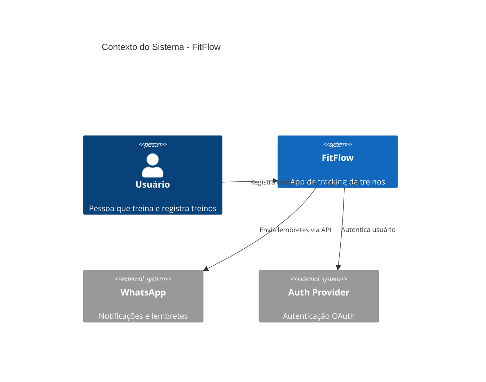
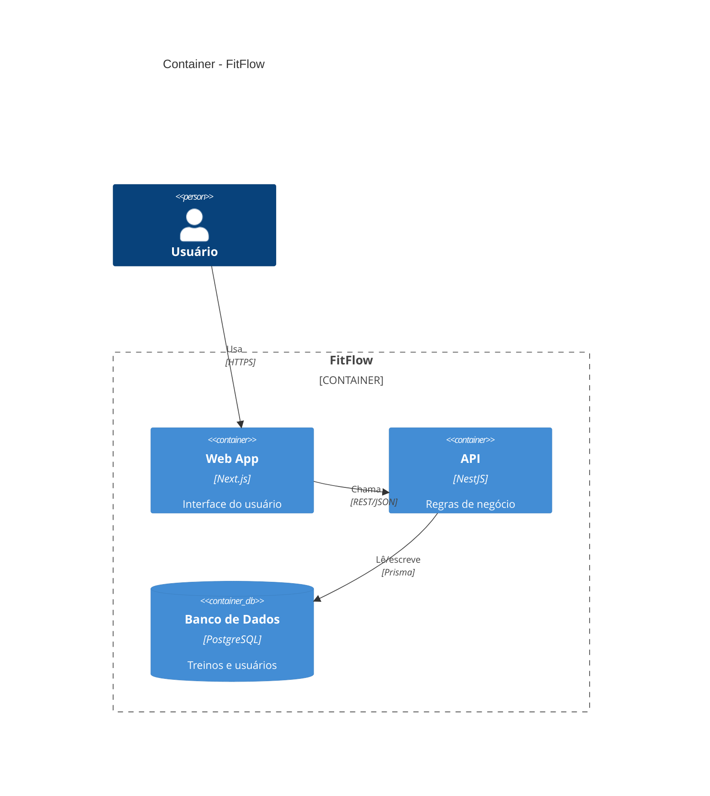
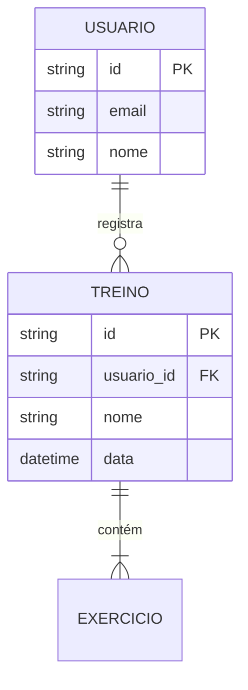
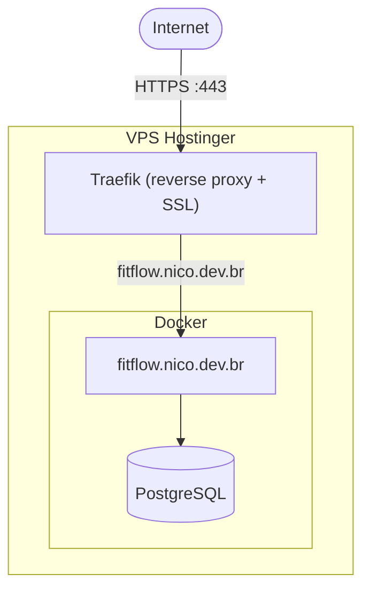
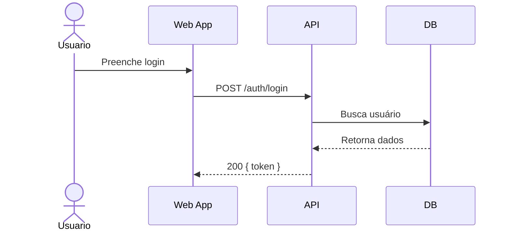

Todo projeto chega num ponto em que ninguém mais consegue explicar de cabeça como as peças se conectam. Quais containers rodam na VPS, o que fala com o quê, como as tabelas se relacionam. A documentação existe na cabeça de quem escreveu o código — e some quando essa pessoa esquece.

Mermaid resolve a parte chata desse problema: você escreve texto, ele vira diagrama. Sem arrastar caixinha, sem `.drawio` ilegível no diff do git. E como é texto, é exatamente o tipo de coisa que o Claude gera bem — inclusive lendo seu projeto real e produzindo o diagrama sozinho, sem você descrever nada.

## Por que Mermaid e não Draw.io ou Figma

Três motivos práticos. Primeiro, versiona: o diagrama é um bloco de texto dentro de um `.md`, então ele entra no mesmo PR que mudou a arquitetura. Segundo, renderiza nativo: GitHub, Notion e Obsidian mostram o diagrama sem plugin. Terceiro — e o mais relevante aqui — é o formato mais fácil de gerar e editar via IA, porque é sintaxe estruturada, não XML verboso nem coordenadas de canvas.

A desvantagem é o controle visual fino: se você precisa de um layout pixel-perfect pra apresentação executiva, Mermaid não é a ferramenta. Pra documentação técnica que o time vai manter, é a escolha certa.

## Os tipos de diagrama que cobrem quase todo projeto

**C4 Model** — visão em camadas da arquitetura lógica. Nível de Contexto mostra quem usa o sistema e com que serviços externos ele conversa:

Nível de Container detalha as caixas internas — frontend, backend, banco:

**ERD** — modelagem de banco, direto de um `schema.prisma` se você já tiver um:

**Arquitetura de infra** — onde as coisas rodam de verdade: VPS, Docker, Traefik, banco central:

**Sequence diagram** — ordem temporal de chamadas, ideal pra auth flow ou lifecycle de request:

Regra prática pra escolher: se a pergunta é "quem conversa com quem, sem ordem definida", é C4 ou infra. Se é "em que ordem as coisas acontecem", é sequence. Se é "como os dados se relacionam", é ERD.

## Gerando do zero: os prompts

O Claude já sabe gerar Mermaid direto, mas prompts específicos economizam idas e vindas:

> "Cria um diagrama C4 de contexto pro projeto X: é um app de [descrição], usuários fazem [ação principal], integra com [serviços externos]."

> "Modela o banco em ERD: tenho as tabelas usuário, pedido e produto, um usuário faz vários pedidos, um pedido tem vários produtos."

> "Desenha a infra: VPS com Traefik, três containers Docker (nomeia os domínios), Postgres central que todos usam."

> "Faz um sequence diagram do fluxo de login: frontend chama a API, API valida no provider OAuth, busca o usuário no banco, retorna token."

Quanto mais concreto o input — nomes reais de domínio, de tabela, de serviço — mais o diagrama vira documentação de verdade em vez de ilustração genérica.

## O caso que mais economiza tempo: modo retroativo

A parte mais útil na prática não é gerar diagrama do zero — é apontar pro projeto que já existe, sem README atualizado, e pedir pro Claude extrair a arquitetura sozinho:

> "Documenta esse projeto visualmente: olha o docker-compose, o schema.prisma e a estrutura de pastas, e gera os diagramas de infra, ERD e C4 container."

Nesse modo o Claude escaneia arquivos estruturados — `docker-compose.yml` e labels do Traefik viram infra, `schema.prisma` vira ERD, `package.json` mais a estrutura de pastas vira C4 Container. São fontes confiáveis porque já são texto estruturado, não interpretação de lógica solta.

O ponto de atenção: o que vem direto de config é fato, mas relação de negócio inferida de nome de variável ou de código espalhado é suposição. Um bom resultado retroativo avisa o que foi extraído com certeza e o que precisa da sua confirmação — se o diagrama vier sem essa distinção, vale perguntar antes de tratar como documentação oficial.

## Organizando a documentação

Diagrama solto na conversa não vira documentação — precisa de lugar fixo. Convenção que funciona bem: `docs/diagrams/` na raiz do repo, um arquivo `.md` por diagrama, nome no padrão `tipo-nome-do-projeto.md` (`infra-fitflow.md`, `erd-fitflow.md`).

Pra sistemas com várias partes, prefira vários diagramas pequenos a um gigante ilegível — um C4 Contexto geral mais um Container por serviço, em vez de tentar enfiar tudo numa imagem só. E pra quem tem múltiplos projetos na mesma VPS, funciona bem separar um diagrama de infra "guarda-chuva" (todos os containers) dos diagramas de arquitetura lógica de cada projeto individual.

O detalhe que decide se isso vira hábito ou vira lixo desatualizado: re-rodar o scan quando a infra muda, não só na primeira vez. Diagrama desatualizado é pior que não ter diagrama nenhum, porque ele mente com confiança. Se sua rotina já tem `CLAUDE.md` e comandos customizados, vale criar um `/diagram-infra` que roda esse fluxo de scan sempre que precisar, em vez de reexplicar o contexto toda vez.
