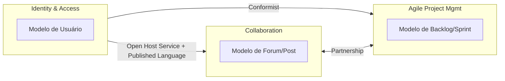

Vaughn Vernon publicou **Implementing Domain-Driven Design** em 2013, quase dez anos depois do livro original de Eric Evans que cunhou o termo. A proposta do "livro vermelho" (como ficou apelidado, pela capa) é diferente da de Evans: onde Evans é filosófico e cheio de nuance, Vernon é pragmático — cada conceito estratégico vem acompanhado de código, exemplo de refatoração e decisão de arquitetura concreta, usando um domínio fictício de gestão ágil de projetos (SaaSOvation) como fio condutor.

Reorganizei o conteúdo por tema em vez de seguir a ordem dos capítulos, separando design estratégico (como delimitar e conectar modelos) de design tático (como implementar um modelo rico dentro de um bounded context).

## O problema que o DDD resolve

A tese central é que sistemas de software complexos falham menos por limitação técnica e mais por **desalinhamento entre o modelo de código e o modelo mental do negócio**. Um sistema onde `Order`, `Customer` e `Invoice` no código não correspondem ao que um especialista de domínio realmente descreveria — com as mesmas palavras, as mesmas regras, os mesmos limites — acumula tradução manual em cada ponto de contato. Cada desenvolvedor interpreta o domínio à sua maneira, e o modelo vira um "modelo de dados" genérico que não captura comportamento nenhum.

DDD ataca isso com duas frentes que se sustentam mutuamente: **design estratégico**, que decide onde traçar fronteiras entre modelos diferentes e como esses modelos se relacionam; e **design tático**, que decide como construir um modelo rico e expressivo dentro de cada fronteira.

## Linguagem ubíqua: o vocabulário como contrato

A linguagem ubíqua é o ponto de partida de tudo: um vocabulário compartilhado entre desenvolvedores e especialistas de domínio, usado sem tradução tanto na conversa quanto no código. Se o time de negócio fala em "backlog item", "commitment" e "sprint", essas palavras — com o significado exato que o negócio dá a elas — devem aparecer como classes, métodos e nomes de evento no código, não como uma abstração técnica genérica por cima.

Vernon insiste que a linguagem ubíqua não é estática: ela evolui através de conversa contínua com especialistas, e o código deve ser refatorado para acompanhar essa evolução. Um glossário documentado à parte, sem espelho no código, morre rápido — o "contrato" só é válido enquanto o modelo de código o reflete de verdade.

## Bounded context: onde o modelo tem fronteira

Nenhuma linguagem ubíqua é universal para uma empresa inteira. "Cliente" no contexto de Vendas não é o mesmo objeto, com os mesmos atributos e regras, que "Cliente" no contexto de Suporte. Tentar forçar um modelo único e compartilhado por toda a organização — o erro mais comum em sistemas legados — produz um modelo inchado, cheio de campo opcional e regra condicional que só existe para acomodar um contexto que não é o seu.

Um **bounded context** é a fronteira explícita — normalmente também uma fronteira de código-fonte, de time e de banco de dados — dentro da qual um modelo específico e sua linguagem ubíqua são válidos e consistentes. Fora dela, o mesmo termo pode (e deve) significar outra coisa. Definir bem essa fronteira é, segundo Vernon, a decisão de design estratégico mais importante do livro: contexto errado contamina todo o resto com acoplamento acidental.

## Context mapping: como os contextos conversam

Sistemas reais têm vários bounded contexts que precisam trocar informação. O **context map** documenta essas relações e o tipo de dependência entre elas:

Os padrões de relacionamento mais usados no livro:

| Padrão | O que significa | Quando aparece |
|---|---|---|
| Partnership | Dois times avançam juntos, coordenando entregas | Times cooperativos, sem hierarquia de dependência |
| Shared Kernel | Um subconjunto de modelo é compartilhado deliberadamente | Overlap pequeno e estável entre dois contextos |
| Customer/Supplier | Um contexto depende do outro, com prioridade negociada | Time consumidor tem voz no roadmap do fornecedor |
| Conformist | O consumidor aceita o modelo do fornecedor sem negociar | Fornecedor externo ou sem interesse em cooperar |
| Anticorruption Layer | Camada de tradução isola o modelo próprio de um modelo externo "sujo" | Integração com legado ou sistema de terceiro |
| Open Host Service | O fornecedor expõe um protocolo público, desacoplado de clientes específicos | Um contexto serve muitos consumidores diferentes |
| Separate Ways | Nenhuma integração — duplicar é mais barato que acoplar | O custo de integrar supera o benefício |

A **Anticorruption Layer** é a que Vernon mais enfatiza na prática: sempre que seu bounded context conversa com um sistema legado ou externo cujo modelo você não controla, uma camada de tradução evita que os conceitos "vazem" e corrompam o seu próprio modelo com o vocabulário e as inconsistências do outro lado.

## Subdomínios: core, supporting, generic

Nem toda parte do negócio merece o mesmo investimento de modelagem. Vernon usa a distinção de Evans entre três tipos de subdomínio: o **core domain** é a razão de existir do negócio, onde a complexidade justifica todo o esforço de DDD tático; **supporting subdomains** são necessários mas não diferenciam a empresa da concorrência; **generic subdomains** resolvem problemas já resolvidos pelo mercado (autenticação, envio de e-mail) e geralmente devem ser comprados ou usados prontos, não modelados do zero.

O erro clássico é gastar o mesmo cuidado arquitetural num generic subdomain que no core — desperdiçando o recurso mais escasso do time (atenção de modelagem) onde ele gera menos retorno.

## Entidade x Value Object: a distinção tática mais fundamental

Do lado tático, a primeira decisão para cada conceito do domínio é: ele tem identidade que persiste ao longo do tempo, ou é definido inteiramente pelos seus atributos?

| | Entidade | Value Object |
|---|---|---|
| Identidade | Tem identidade única, rastreada mesmo quando atributos mudam | Não tem identidade — dois VOs com os mesmos atributos são iguais |
| Mutabilidade | Pode mudar de estado ao longo do ciclo de vida | Imutável — qualquer "mudança" cria uma nova instância |
| Igualdade | Por identidade (mesmo ID = mesmo objeto) | Por valor (mesmos atributos = objetos iguais) |
| Exemplo | `Product`, `BacklogItem`, `Customer` | `Money`, `BusinessPriority`, `PhoneNumber` |

Vernon defende usar Value Object como padrão sempre que possível, e só promover algo a Entidade quando a identidade e o rastreio de ciclo de vida são de fato necessários para o negócio. A maioria dos modelos ingênuos erra na direção oposta — transforma tudo em Entidade "só para garantir", e acaba com objetos mutáveis onde imutabilidade resolveria a maior parte dos bugs de concorrência e efeito colateral.

## Agregado: a unidade de consistência transacional

O conceito tático mais debatido do livro é o **Aggregate**: um cluster de Entidades e Value Objects tratado como unidade única para fins de mudança de dado e transação. Todo agregado tem uma **Aggregate Root** — a única Entidade acessível de fora do cluster, responsável por garantir que qualquer mudança mantenha o conjunto inteiro em estado consistente.

A regra mais importante — e mais frequentemente violada em código real — é: **um agregado por transação**. Se uma operação de negócio parece exigir mudar dois agregados atomicamente, isso é sinal de que a fronteira do agregado está desenhada errado, ou de que a consistência entre eles pode ser **eventual** em vez de imediata, coordenada por um evento de domínio.

Vernon recomenda projetar agregados **pequenos**, referenciando outros agregados por identidade (ID), nunca por referência direta de objeto. Agregados grandes parecem convenientes no início, mas travam em contenção de escrita e carregam dado que a maioria das operações nem usa.

## Domain Event: comunicar o que já aconteceu

Um **Domain Event** captura algo relevante que aconteceu no domínio — sempre no passado (`BacklogItemCommitted`, não `CommitBacklogItem`) — e permite que outras partes do sistema, dentro ou fora do bounded context, reajam sem acoplamento direto. É a peça que resolve o problema da consistência entre agregados sem quebrar a regra de "um agregado por transação": o agregado A muda e publica um evento; o agregado B (ou outro bounded context inteiro) reage a esse evento de forma assíncrona.

Eventos de domínio também viram, na prática de Vernon, uma forma de integração entre bounded contexts — combinados com Open Host Service e Published Language, eliminam a necessidade de acoplamento síncrono via chamada direta entre serviços.

## Repository, Domain Service e Application Service

Três peças completam o vocabulário tático, cada uma com um papel que não deve se misturar:

- **Repository** — dá a ilusão de uma coleção em memória para agregados, escondendo a persistência real (SQL, NoSQL, cache). Trabalha sempre em termos de Aggregate Root completo, nunca em fragmentos.
- **Domain Service** — quando uma operação de negócio não pertence naturalmente a nenhuma Entidade ou Value Object específico (geralmente porque envolve mais de um agregado), vira uma operação sem estado no próprio domínio.
- **Application Service** — a camada fina que orquestra um caso de uso: recebe o comando, busca agregados via Repository, invoca o domínio, persiste, publica evento. Não deve conter regra de negócio — isso pertence ao domínio, nunca à camada de aplicação.

A confusão mais comum em times que adotam DDD pela metade é colocar regra de negócio dentro do Application Service — recriando, com nomes diferentes, o mesmo Transaction Script anêmico que o DDD tenta evitar.

## Arquitetura: onde o modelo rico mora

Vernon dedica boa parte da segunda metade do livro a discutir estilos arquiteturais que **protegem** o modelo de domínio de detalhes de infraestrutura — porque um modelo tático bem desenhado, colocado dentro de uma arquitetura em camadas tradicional e mal isolada, acaba contaminado por preocupação de banco de dados e framework mesmo assim.

A **Arquitetura Hexagonal** (Ports & Adapters) é a que ele mais recomenda como padrão-base: o domínio fica isolado no centro, sem nenhuma dependência de framework ou infraestrutura; portas definem os pontos de entrada e saída; adaptadores plugam tecnologia concreta (REST, banco, fila) nessas portas. O domínio pode, em teoria, ser testado inteiramente sem subir banco de dados ou servidor HTTP.

Vernon também apresenta **CQRS** (separar modelo de escrita e modelo de leitura) e **Event Sourcing** (persistir o histórico de eventos como fonte da verdade, em vez do estado atual) como evoluções para casos onde o modelo de leitura tem exigências de performance ou de auditoria muito diferentes do modelo de escrita — mas deixa claro que nenhum dos dois é padrão default: ambos adicionam complexidade real e só compensam quando o problema de negócio justifica.

## O que ainda vale hoje

O livro tem mais de dez anos e alguns exemplos de código — Java, EJB, frameworks específicos de 2013 — envelheceram tecnicamente. A crítica mais recorrente é que o livro é denso e repetitivo em alguns capítulos táticos, e que o exemplo SaaSOvation, embora didático, é mais simples do que a maioria dos sistemas reais onde DDD compensa o esforço.

O que não envelheceu é a distinção estratégica entre bounded context, linguagem ubíqua e os padrões de context mapping — esse é o núcleo que continua relevante mesmo em arquiteturas modernas de microsserviços, onde cada serviço tende (na prática, nem sempre por design consciente) a corresponder a um bounded context. E o vocabulário tático — Entidade, Value Object, Aggregate, Domain Event — virou linguagem comum o suficiente para aparecer em código de times que nunca leram o livro, o que é talvez o maior sinal de que a ideia central se provou certa.
